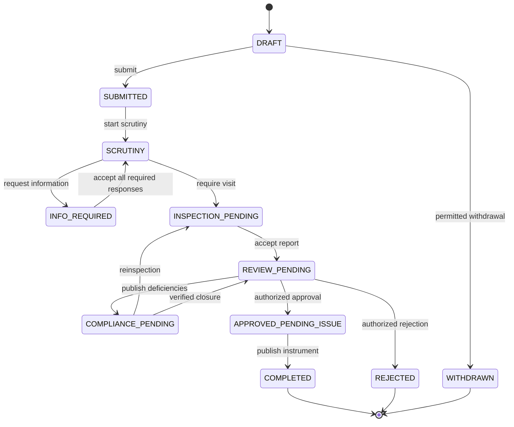

# Workflow, state machines and policy execution

**Agni Setu implementation baseline 2.0.0 | 2026-09-09**  
**Status:** build specification; not evidence of a completed implementation or government approval.

## 1. One canonical vocabulary

Use these exact application values in database constraints, OpenAPI enums, frontend types, fixtures, reports and tests:

```text
DRAFT
SUBMITTED
SCRUTINY
INFO_REQUIRED
INSPECTION_PENDING
REVIEW_PENDING
COMPLIANCE_PENDING
APPROVED_PENDING_ISSUE
COMPLETED
REJECTED
WITHDRAWN
```

COMPLETED, REJECTED and WITHDRAWN are terminal. An outage is not a business state. A draft has not been received. A favorable decision and published certificate are different milestones. The display label for APPROVED_PENDING_ISSUE is `Approved - certificate processing`.

## 2. Main lifecycle



The diagram emphasizes the normal route; the table below is the full authorized transition catalogue. Inspection may be skipped only by a separately approved service profile with its own explicit transition and tests; this baseline does not provide a generic bypass.

## 3. Transition catalogue

| ID | Command | From | To | Required guard | Event |
| --- | --- | --- | --- | --- | --- |
| TR-01 | submit | DRAFT | SUBMITTED | Editable owner; complete revision; clean required files; active profile; receipt and obligations atomic | application.submitted.v1 |
| TR-02 | start-scrutiny | SUBMITTED | SCRUTINY | Scoped reviewer and accountable review queue | scrutiny.started.v1 |
| TR-03 | request-information | SCRUTINY | INFO_REQUIRED | At least one itemized completeness requirement; due basis; publish permission | notice.published.v1 |
| TR-04 | accept-information | INFO_REQUIRED | SCRUTINY | Every required response verified accepted; current notice round | information.accepted.v1 |
| TR-05 | require-inspection | SCRUTINY | INSPECTION_PENDING | Completeness accepted; service requires visit; route resolved | inspection.requested.v1 |
| TR-06 | accept-report | INSPECTION_PENDING | REVIEW_PENDING | Assigned actor; accepted immutable report; current schema and evidence | inspection.report_accepted.v1 |
| TR-07 | issue-deficiencies | REVIEW_PENDING | COMPLIANCE_PENDING | Itemized findings and notice; owner and response obligation | deficiencies.published.v1 |
| TR-08 | complete-corrections | COMPLIANCE_PENDING | REVIEW_PENDING | All mandatory findings verified closed; no reinspection outstanding | compliance.verified.v1 |
| TR-09 | require-reinspection | COMPLIANCE_PENDING | INSPECTION_PENDING | Reason, linked findings and new attempt; preserve existing case clock | inspection.reinspection_requested.v1 |
| TR-10 | approve | REVIEW_PENDING | APPROVED_PENDING_ISSUE | Effective decision authority; version fence; required evidence and findings cleared | decision.approved.v1 |
| TR-11 | publish-instrument | APPROVED_PENDING_ISSUE | COMPLETED | Required artifact and signature verified; stable issuance ID; registry atomic | certificate.published.v1 |
| TR-12 | reject | SCRUTINY, INFO_REQUIRED, REVIEW_PENDING, COMPLIANCE_PENDING | REJECTED | Profile explicitly permits this stage and reason; effective authority; notice obligations met | decision.rejected.v1 |
| TR-13 | withdraw | DRAFT, SUBMITTED, SCRUTINY, INFO_REQUIRED, INSPECTION_PENDING, COMPLIANCE_PENDING | WITHDRAWN | Profile permits withdrawal stage; authorized request; no active approval; obligation disposition | application.withdrawn.v1 |
| TR-14 | return-for-clarification | REVIEW_PENDING | INSPECTION_PENDING | Supervisor records report clarification request and creates a new permitted attempt/addendum task | inspection.clarification_requested.v1 |
| TR-15 | register-external | SCRUTINY, REVIEW_PENDING | COMPLETED | External-registration profile enabled; issuer authority and source artifact verified; outcome REGISTERED_EXTERNAL | certificate.external_registered.v1 |


TR-14 is a clarification/reinspection route, not an overwrite of the previous report. TR-15 is profile-dependent external registration, with outcome kind REGISTERED_EXTERNAL. The initial department-review demo rejects in REVIEW_PENDING only; other rejection stages listed in TR-12 are disabled unless the active profile explicitly enables them. Withdrawal is not allowed in REVIEW_PENDING, APPROVED_PENDING_ISSUE or any terminal stage in the demo. A draft withdrawn before receipt remains excluded from submitted-case reports.

## 4. Commands that do not change application state

Saving an editable draft, attaching evidence, scheduling a visit, starting a visit, recording a failed visit, submitting a notice response, verifying one finding, acknowledging an escalation, requesting an export and retrying a delivery do not directly change the application state. They mutate their own resources and may create obligations. Only a named transition command performs the next application transition when its full guard succeeds.

For example, `submit-response` changes a notice item to RESPONSE_RECEIVED but not INFO_REQUIRED to SCRUTINY. `acknowledge-escalation` records ownership of intervention but does not satisfy the overdue obligation. `retry-issuance` resumes the same issuance request but never allocates a new decision.

## 5. Supporting state machines

| Resource | States and transitions | Invariant |
| --- | --- | --- |
| Inspection attempt | REQUESTED -> SCHEDULED -> IN_PROGRESS -> COMPLETED; SCHEDULED/IN_PROGRESS -> FAILED; REQUESTED/SCHEDULED -> CANCELLED | A failed attempt is retained. An already completed attempt cannot be rescheduled. |
| Assignment | ACTIVE -> SUPERSEDED or REVOKED or FULFILLED | One active assignment per attempt. History keeps previous officer and effective interval. |
| Finding | OPEN -> RESPONSE_RECEIVED -> UNDER_REVIEW -> VERIFIED_CLOSED; UNDER_REVIEW -> OPEN with reason | Applicant cannot execute VERIFIED_CLOSED. Reopening creates a review event. |
| Notice | DRAFT -> PUBLISHED -> SATISFIED; PUBLISHED -> SUPERSEDED/CANCELLED by authority | Published content is immutable. Item state is tracked separately. |
| File | RESERVED -> UPLOADED -> QUARANTINED -> CLEAN or REJECTED; RESERVED -> EXPIRED | CLEAN binds an immutable object version and checksum. |
| Policy version | DRAFT -> IN_REVIEW -> APPROVED -> SCHEDULED -> ACTIVE -> RETIRED; IN_REVIEW -> RETURNED -> DRAFT | Approved payloads are immutable; later changes create another version. |
| Obligation | ACTIVE <-> PAUSED -> SATISFIED or CANCELLED | Overdue is calculated, not a terminal state. Pauses are separate intervals. |
| Job | READY -> RUNNING -> COMPLETE; RUNNING -> RETRY_WAIT or RECONCILIATION_REQUIRED or DEAD_LETTER | Completion must match the current lease token. |
| Notification attempt | READY -> SENDING -> ACCEPTED_BY_PROVIDER -> DELIVERED; failure/UNKNOWN tracked separately | Provider acceptance is not proof of delivery. |
| Certificate | ACTIVE -> EXPIRED by time; authorized SUSPENDED/REVOKED/SUPERSEDED actions | Expiry is effective at the interval boundary even before a scheduler updates a projection. |
| Support ticket | OPEN -> IN_PROGRESS -> WAITING_FOR_REQUESTER -> RESOLVED -> CLOSED; reopen creates an event | Support resolution cannot change a regulatory decision. |
| Appeal case | RECEIVED -> ADMISSIBILITY_REVIEW -> IN_REVIEW -> DECIDED, or INADMISSIBLE/WITHDRAWN | Disabled until profile and authority approved; source decision is retained. |

An expired certificate must never become ACTIVE through reinstatement. Reinstatement is only available for a suspended, still-in-force certificate where policy allows it. A revocation cannot be undone by a generic status dropdown; any lawful reversal needs a separate instrument and approved contract.

## 6. Policy package shape

The following is a complete small example of the **demonstration** policy structure, not a legal rule. Validate it with a versioned JSON Schema and reject unknown executable constructs. Policies contain data, not arbitrary Python, SQL or JavaScript.

```json
{
  "schema_version": "1.0",
  "key": "DEMO-DEPARTMENT-REVIEW",
  "version": 1,
  "mode": "DEMO",
  "outcome_kind": "DEMO_CERTIFICATE",
  "jurisdiction_key": "CENTRAL-PILOT",
  "effective_from": "2026-01-01T00:00:00Z",
  "effective_until": null,
  "timezone": "Asia/Kolkata",
  "calendar_key": "DEMO-WORKING-CALENDAR-V1",
  "allowed_categories": ["Restaurant", "Office", "Hospital", "School", "Residential", "Hotel", "Warehouse"],
  "form_schema_key": "premises-v1",
  "checklist_key": "demo-checklist-v1",
  "base_documents": ["ownership", "plan", "electrical"],
  "extra_documents": {"Hospital": ["evacuation"], "School": ["evacuation"], "Hotel": ["evacuation"]},
  "inspection_required": true,
  "reject_from": ["REVIEW_PENDING"],
  "withdraw_from": ["DRAFT", "SUBMITTED", "SCRUTINY", "INFO_REQUIRED", "INSPECTION_PENDING", "COMPLIANCE_PENDING"],
  "separation_of_duties": {"inspector_cannot_decide": true, "preparer_cannot_approve_policy": true},
  "internal_targets": {"scrutiny_working_minutes": 480, "inspection_calendar_minutes": 10080, "review_working_minutes": 480, "issuance_calendar_minutes": 1440},
  "case_target_calendar_minutes": 43200,
  "applicant_response_calendar_minutes": 10080,
  "reminder_fractions": [0.75, 1.0],
  "escalation_minutes_after_due": [60, 1440],
  "permitted_pause_reasons": ["AUTHORIZED_ADMINISTRATIVE_HOLD"],
  "sample_validity_days": 365,
  "fees": {"enabled": false},
  "appeals": {"enabled": false, "referral_text": "Contact the demonstration support desk; this is not a legal appeal service."},
  "external_registration": {"enabled": false},
  "public_fields": ["certificate_number", "status", "premises_display_name", "locality", "issued_at", "valid_until", "checked_at", "is_demo"]
}
```

Approvals, signatures of approval, preparer identities and payload hash are relational governance records, not user-editable properties inside this JSON. The JSON payload references immutable calendar, checklist, form and routing versions. Schema migration is separate from legal-policy migration.

## 7. Choosing and pinning a policy

On submission, use the service, jurisdiction, declared applicability facts and the service-defined legally relevant date. Demo uses server submission time. Select one approved effective policy. Zero matches returns POLICY_UNAVAILABLE; multiple matches returns POLICY_AMBIGUOUS and an operational alert. Never choose the last array entry or a cached arbitrary version.

Lock the service activation fence while selecting and storing the policy reference. Policy activation uses the same fence. This prevents concurrent activation and submission from recording an inconsistent selection. Store selection explanation and input facts with the immutable submission snapshot. Later profile changes cannot change that snapshot.

Submitted cases remain on their pinned policy unless a legally approved migration requires otherwise. A migration specifies affected population, source and target versions, grandfathering, evidence requirements, clock transformation, notices, rollback limits and owner approval. Dry-run counts and per-case differences must be reviewed before execution. Never bulk-rewrite `policy_version_id` directly.

## 8. Clock model

Each submission creates a case-target obligation and the current stage's task obligations. Each new cycle gets its own stage-instance UUID. An information request creates an applicant response obligation; it does not silently reset the case target. Demo working calendar is Monday-Friday, 09:00-17:00 Asia/Kolkata with no holidays; it is explicitly synthetic.

Store time instants in UTC, calendar rules in an IANA timezone, and duration budgets in integer minutes. `created_at`, `captured_at`, `accepted_at` and `effective_at` have different meanings. Only `accepted_at` establishes a demo server receipt. Avoid subtracting formatted local date strings.

Active elapsed time for an obligation is the measure of eligible calendar intervals between start and cutoff, minus the union of authorized pause intervals intersecting those intervals. Clamp open pauses to the reporting cutoff. Subtract overlapping pauses once. The due instant is the earliest instant at which active time reaches the budget. Boundary equality means due, not one second later. Overnight, weekends, daylight-saving changes in future jurisdictions and holidays must be handled by timezone-aware interval logic.

A PAUSED obligation still has its original start, budget and pause history. Open-ended pause means no final due estimate; show `Paused - due date will be recalculated`, not a fictitious far-future deadline. End-to-end elapsed age continues unless its independent policy explicitly permits the same pause. Technical outages never create pause events automatically.

### Worked tests

| Start and condition | Expected internal due |
| --- | --- |
| Monday 09:00, 240 working minutes, no pause | Monday 13:00 |
| Same, authorized pause 10:00-11:00 | Monday 14:00 |
| Same, pauses 10:00-11:00 and 10:30-11:30 | Monday 14:30, not 15:00 |
| Friday 16:00, 240 working minutes, no holidays | Monday 12:00 |
| Friday 16:00, Monday is a pinned holiday | Tuesday 12:00 |
| 24 calendar hours started Saturday 10:30 | Sunday 10:30 regardless of working calendar |

## 9. Atomic transition algorithm

```text
validate syntax and authenticated session
resolve scoped record without revealing unauthorized existence
begin transaction
  lock principal authorization fence(s), then service activation fence if needed
  lock application and affected child records in deterministic order
  recheck account, role, grant, delegation, assignment and service mode
  look up command key; if accepted and identical, return authorized original receipt
  compare expected version; reject stale or missing precondition
  evaluate transition, policy and evidence guards
  write new canonical state/revision and increment version
  write business event, obligation changes, audit and outbox intents
  write immutable command receipt with request hash and canonical response
commit
return accepted result; dispatch external work separately
```

The application layer owns transaction boundaries. Domain guards are pure functions over typed snapshots and current authorized facts. No external network call occurs while holding these database locks. Recheck authority before publication when policy requires a still-effective publishing authority; a previously valid decision is preserved even if publication requires a new authorization.

## 10. Exceptional but valid routes

A legal or administrative hold has its own record, authority, reason, start/end and impacted obligation IDs. It is not a twelfth case state. Missed appointments generate rescheduling work, not auto-closure. Routing exceptions retain an accountable central queue. Staff absence leads to reassignment by a permitted supervisor. Duplicate premises applications are flagged for review; do not silently merge applications based on similar names.

Do not generalize the state machine into arbitrary user-defined executable graphs in v1. Add a new transition through a versioned contract, permission rule, migration consideration, UI behavior and tests. Prevent unknown states at both serializer and database levels.


## 12. Clarification and simulation guards

TR-14 is the deliberate engineering extension for returning an accepted report for additional physical inspection. Baseline 2.0 requires a new visit; no-visit report editing is not enabled. Preserve the old report and create a new attempt linked to it. The prototype action called `return-review` instead maps to TR-08 complete-corrections; do not confuse the two commands.

Before policy approval, run the allowlisted deterministic simulation suite against the exact frozen candidate hash, calendar/checklist versions and engine version. The approver reviews successful results independently of the preparer. A stale result, failed check or edited candidate blocks approval. Simulation is not evidence of legal approval and never changes active applications.

---
[Documentation index](../README.md) | [Source register](20_SOURCE_REGISTER_AND_GLOSSARY.md) | [Implementation status](21_IMPLEMENTATION_STATUS.md)
