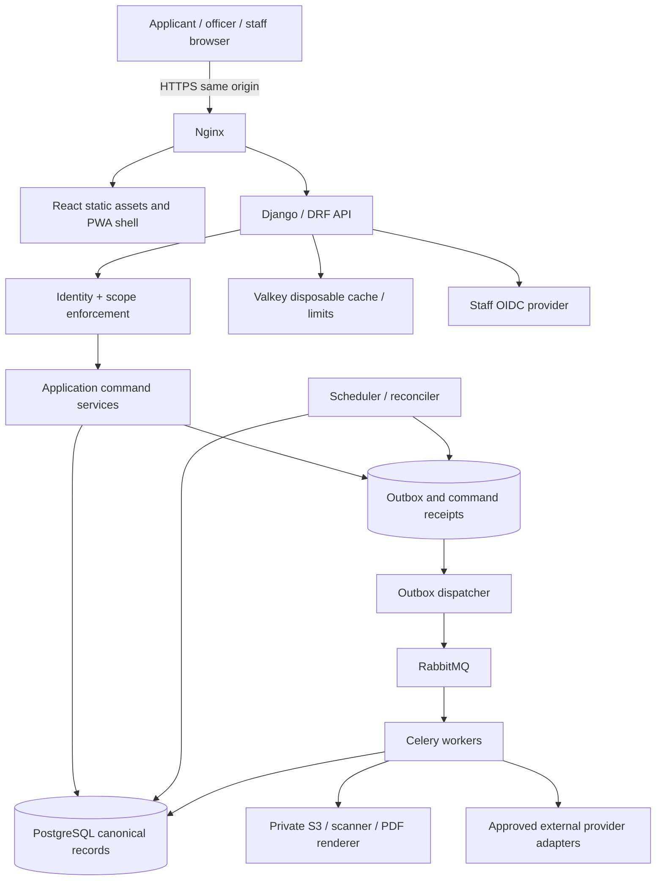

# Technical architecture and selected technology stack

**Agni Setu implementation baseline 2.0.0 | 2026-09-09**  
**Status:** build specification; not evidence of a completed implementation or government approval.

## 1. Architecture decision

Build a **modular monolith**: one Django application codebase containing explicitly bounded business modules, one PostgreSQL system of record, one React web/PWA client, and separately deployable worker/scheduler processes using the same application services. This is a transactional government case-management application; reliable invariants and maintainability take priority over framework novelty or service count.

The earlier project specification recommends Flask/MongoDB. This package intentionally supersedes that recommendation for a greenfield implementation. Django provides an integrated model/migration/security foundation; PostgreSQL gives the design a direct way to enforce relations, uniqueness, row locking and booking overlaps, while JSONB accommodates versioned variable forms. This is a design judgement for this project, not a claim that Flask or MongoDB cannot implement it. Existing implementation code, if discovered, must be inventoried before replacing anything.

## 2. Selected stack and dependency policy

| Layer | Selected baseline | Reason and boundary |
| --- | --- | --- |
| Python runtime | Python 3.12, supported security patch pinned at B00 | Conservative runtime for the selected Python ecosystem; never use floating image tags in a release. |
| Backend | Django 5.2 LTS | Long-term support baseline, ORM, migrations, sessions, CSRF and explicit transaction management. |
| HTTP API | Django REST Framework 3.16 compatible patch; drf-spectacular | Validated serializers, permission hooks, generated OpenAPI; custom application-service layer owns business rules. |
| Database driver | psycopg 3 | PostgreSQL driver; parameterized ORM/SQL, bounded connection pools. |
| Database | PostgreSQL 17, latest supported security/minor patch at lock time | Foreign keys, transactions, JSONB, partial indexes and exclusion constraints. |
| Web runtime | Node.js 24 LTS | Build/test tooling only; business backend is Python. |
| Web UI | React 19 + TypeScript, stable compatible release pinned at B00 | Typed components and predictable role-specific SPA. Do not introduce experimental server components. |
| Web bundler | Vite 8 compatible stable patch | SPA development/build, explicit same-origin API proxy in development. |
| Styling | Tailwind CSS 4 + CSS design tokens | Preserve the actual prototype visual language; components use semantic tokens, not scattered arbitrary colors. |
| Accessible primitives | Radix UI primitives through locally maintained shadcn-style components | Dialogs, menus and focus behavior; generated/copied components become maintained project code. |
| Routing | React Router 7, browser router | Nested layouts, deep links and route-level error boundaries. Use SPA mode, not an additional server framework. |
| Server state | TanStack Query 5 | Request caching, invalidation and background refresh; cache is not business authority. |
| Forms | React Hook Form 7 + Zod 4 compatible versions | Client usability validation; server serializers/domain rules remain authoritative. |
| Offline storage | Dexie 4 / IndexedDB | Versioned local packages and operation queue, not browser-local production database. |
| PWA | Workbox with a Vite-compatible service-worker build | Cache static shell; allowlisted offline assignment packages only; no blanket authenticated API caching. |
| Tasks | Celery 5.6 compatible stable patch | Execute persisted logical jobs; task acknowledgement is not proof of business completion. |
| Broker | Supported RabbitMQ 4.x image with matching bundled Erlang | Durable job transport; PostgreSQL outbox/reconciler remains the recovery source. |
| Disposable cache / rate-limit store | Valkey 8.1 supported patch, Redis-protocol client | Cache and anti-abuse coordination only. Do not put authoritative obligations, grants or unique business decisions here. |
| Sessions | Django database-backed sessions | Shared server session revocation; no browser JWT/localStorage dependency. |
| Staff identity | OpenID Connect via Authlib; Keycloak 26.x for local integration tests | Federation adapter; production agency-approved identity provider. Local Keycloak start-dev never used in live deployment. |
| Applicant identity | Contact OTP service with a replaceable message provider | Rate-limited, single-use verification; not proof of building ownership. |
| Files | Private S3-compatible object-storage interface using boto3 | Production agency-approved supported object service; immutable version references and checksums. |
| Local S3 emulator | Pinned SeaweedFS `weed mini`, loopback-bound with credentials | Development/test only. Production deployment requires a separately reviewed storage service. |
| Malware scanning | ClamAV adapter in a dedicated worker/container | Technical file safety signal, not legal or semantic document approval. |
| PDF generation | WeasyPrint, QR library; isolated rendering worker | Templates are project-controlled; disable arbitrary network fetches. Real signatures require an approved provider. |
| API serving | Gunicorn behind Nginx | One same-origin portal/API endpoint; private upstream services. |
| Tests | pytest, pytest-django, Hypothesis, Playwright, Vitest, Testing Library, axe-core | Domain/property, real-database, browser, accessibility and failure tests. |
| Performance | Locust with reproducible scenarios | Measure approved target workload, not fabricated benchmark claims. |
| Quality / supply chain | Ruff, mypy, ESLint, TypeScript checks, dependency/secret/container scans, SBOM | Lock and audit dependencies; fail CI on agreed severity thresholds. |
| Packaging | uv for Python, pnpm for web; Docker Compose; GitHub Actions | Reproducible environments and approval-gated delivery; no Kubernetes required for initial pilot. |
| Observability | Structured logs + OpenTelemetry-compatible tracing + Prometheus metrics; Grafana optional profile | Correlate case/job/request safely; never place personal data in metric labels. |

The supported release families were reviewed against primary project documentation on 2026-09-09; see [source register](20_SOURCE_REGISTER_AND_GLOSSARY.md). Exact patch versions, transitive dependencies and image digests must be resolved and compatibility-tested at B00 and committed in lockfiles. These family choices are not a pre-tested dependency lock. Do not use `latest`, unbounded upgrades or pretend a dependency vulnerability scan has already been run.

The MinIO community repository was observed archived in the reviewed upstream source. Therefore it is not selected as the default new production storage deployment. S3 compatibility is an interface requirement; procurement and support determine the live implementation. SeaweedFS mini is explicitly only a local emulator and must never be promoted unchanged into a production bucket service.

## 3. Component view



The arrows represent responsibility, not separate microservices for every box. Identity, policies, cases, inspections and certificates are Python modules inside one backend. Workers load the same services and enforce the same invariants. Public verification is a restricted API projection, not direct bucket access.

## 4. Module boundaries

| Module | Owns | May call |
| --- | --- | --- |
| identity | Principals, sessions, contact challenges, grants, delegations | audit and provider ports |
| policies | Service profiles, form/checklist/calendar/routing versions, activation | identity authorization, audit |
| cases | Premises snapshots, drafts, submission revisions, lifecycle | policy selectors, documents, routing, obligations |
| documents | Upload reservations, document versions, scanning and authorized access | object-store/scanner ports, audit |
| routing | Applicable jurisdiction mapping and owned routing exceptions | policies and identity |
| inspections | Attempts, assignments, appointments, draft and accepted reports | identity, documents, policy, obligations |
| notices | Information/deficiency notices, response versions, finding review | cases, documents, inspections |
| decisions | Readiness and immutable reasoned outcomes | case snapshots, policy, identity, findings, certificate request port |
| certificates | Issuance requests, registry, status instruments and verification | renderer/signer/source ports, obligations |
| obligations | Clocks, pause intervals, threshold actions, escalation tasks | calendar domain functions, notification intent port |
| notifications | Recipient intents, template snapshots and delivery attempts | provider ports |
| integrations | Authenticated source inbox, mappings, conflicts and reconciliation | explicit domain command ports |
| reporting | Read models, metrics and controlled exports | scoped selectors only; no business-state writes |
| support | Tickets, referrals and conditional appeals | scoped case references; no direct decision mutation |
| platform | Command kernel, time abstraction, leases, correlation, error envelope | shared infrastructure only |

Keep cross-module writes behind application services. A report query may join tables to create a scoped read model, but reporting must not change application status. Avoid generic `utils.py` becoming the location for business policy.

## 5. Code structure

```text
agni-setu/
  AGENTS.md
  CLAUDE.md
  README.md
  docs/                         # this implementation pack
  references/                   # original read-only prototype
  backend/
    pyproject.toml
    uv.lock
    manage.py
    config/
      settings/{base,local,test,production}.py
      urls.py
      wsgi.py
      celery.py
    agni/
      platform/{clock,commands,errors,authz,outbox,logging}.py
      identity/
      policies/
      cases/
      documents/
      routing/
      inspections/
      notices/
      decisions/
      certificates/
      obligations/
      notifications/
      integrations/
      reporting/
      support/
    tests/{unit,integration,contracts,security,properties}/
  web/
    package.json
    pnpm-lock.yaml
    src/
      app/{router,providers,layouts}/
      components/{ui,forms,feedback}/
      features/{identity,cases,inspections,notices,review,monitoring,certificates,operations,policies,reports,support}/
      api/{generated,client,errors}/
      offline/{database,queue,sync,migrations}/
      design/{tokens.css,global.css}/
      locales/{en,hi}/
      test/
    public/
  contracts/{openapi.yaml,events,policy-schemas}/
  infra/{compose,nginx,containers,identity,monitoring}/
  scripts/{dev,ci,fixtures,ops}/
  tests/{e2e,load,fixtures}/
  evidence/                     # generated test results; no secrets or real PII
  .github/workflows/
```

Inside a business module use `models.py`, `domain/`, `application/commands.py`, `selectors.py`, `api/{serializers,views,urls}.py`, `adapters/` when needed, and `migrations/`. Small modules need not have empty layers. The domain imports dataclasses/enums and pure helpers, not DRF Request or Django HTTP responses. Application services coordinate transactions and ORM repositories. API views translate a validated DTO into one command call.

## 6. Why not the alternatives

Flask/FastAPI can support the domain, but would require choosing and integrating more of the administration, session, migration and security foundation for this specific team. NestJS is a reasonable all-TypeScript alternative but is not selected; do not build two backend stacks. PostgreSQL plus JSONB avoids needing MongoDB solely for variable checklists. Next.js SSR is not necessary for these authenticated transactional workspaces; static public landing pages can be served by the same SPA initially.

Temporal is not required for this baseline. The obligation/outbox/lease design already specifies recovery for the bounded case workflow. Introduce a workflow engine only through an ADR with operational capacity, versioning and migration analysis; never combine two competing workflow authorities accidentally. A message broker is transport, not the case-state machine.

## 7. Request and transaction contract

All commands use an application-service transaction. `transaction.on_commit` may wake a dispatcher but must not be the only place follow-up intent exists. The outbox row must commit with the business change. ORM constraints are the final concurrency boundary for unique records; API validation only improves error messages.

Lock order is principal authorization fences in sorted UUID order, service activation fence if needed, application, then child resources in sorted UUID order. Grant revocation uses the same principal fence as decisions and submissions. An action that locks and checks before revocation commits is serialized before the revocation; one after sees revocation. Long transactions, user interaction and network calls are forbidden while locks are held.

## 8. Read models and freshness

Start with indexed SQL selectors for queues and metrics. Use a transaction-consistent reporting cutoff; the response includes `as_of`, scope and definitions. Cached aggregates must include scope, filter hash, policy/report definition version and expiry. Authorization filtering happens before aggregation. Invalidate or expire projections after events; show their freshness. Cache outage falls back only to a safe bounded database query, not unscoped values.

Use 15-second foreground polling for active queue screens and immediate query invalidation after local accepted commands. Stop polling hidden tabs, apply jitter and backoff, and expose manual refresh. Polling is sufficient for the first release's near-real-time requirement; do not claim hard real-time delivery. Add SSE only after a measured requirement and with a scoped event channel.

## 9. Environment and deployment separation

Use distinct databases, object buckets, signing identities, message destinations and domains for demo, test, staging and live. `SERVICE_MODE` and provider mode are checked at startup and on live activation. A live process fails startup when it references sample signing, console OTP, unrestricted CORS, default secrets or demo reset routes. Development tools and debug pages are absent from production routing.

## 10. Nonfunctional targets

These are proposed acceptance targets on an explicitly recorded pilot environment, not demonstrated capacity. At the test workload of 100 concurrent active sessions and 10,000 seeded cases, target p95 ordinary case reads below 800 ms and p95 non-file command acceptance below 1.5 s. Report generation, scanning and signing are asynchronous and report independent queue/service durations. Target accepted outbox work dispatched within 60 seconds under normal conditions and recover overdue work after outage without loss of accepted business intents.

Target 99.5% monthly pilot application availability only after monitoring and operational ownership exist. Propose RPO <= 15 minutes and RTO <= 4 hours for the pilot; validate with database-plus-object restore drills. Availability targets are not reasons to serve an unsafe certificate assertion. See the test and operations specifications for the measurement method and exclusions.

---
[Documentation index](../README.md) | [Source register](20_SOURCE_REGISTER_AND_GLOSSARY.md) | [Implementation status](21_IMPLEMENTATION_STATUS.md)
