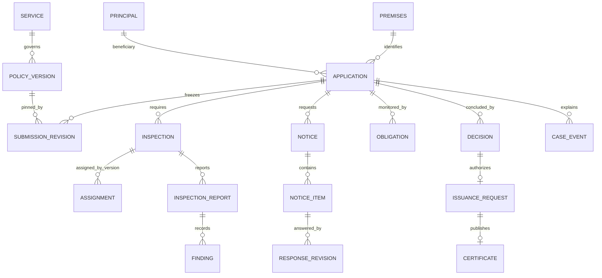

# Data model, integrity constraints and migration strategy

**Agni Setu implementation baseline 2.0.0 | 2026-09-09**  
**Status:** build specification; not evidence of a completed implementation or government approval.

## 1. Database conventions

The canonical engine is PostgreSQL 17. Use UUID primary keys generated server-side. Human references such as `AS-2026-1041` are display/search keys, never authorization secrets. Table names below are conceptual snake_case names; Django model names are their singular PascalCase equivalents. Keep a checked mapping in migrations rather than renaming entities ad hoc.

Unless stated append-only, each mutable business row includes `id uuid PK`, `created_at timestamptz`, `updated_at timestamptz`, `version bigint NOT NULL DEFAULT 1`, and creator/updater identifiers where applicable. Version increments happen inside the guarded application service, not from arbitrary serializer saves. Append-only records have stable IDs and accepted/created timestamps and cannot be updated by ordinary application code. Fields with `?` are nullable; all other fields are required. JSONB payloads are schema-validated, size-bounded and versioned; they do not bypass invariants.

Use foreign keys with PROTECT/RESTRICT for regulatory history. Cascading hard deletion of applications, evidence, notices or decisions is forbidden. Use explicit retention jobs with legal-hold checks. Integers represent counts and duration minutes; Decimal represents measurements or policy-enabled monetary amounts. Store UTC instants and the governing timezone/calendar separately. Email/contact encryption and lookup indexes are designed with the security owner, not improvised in a generic model property.

## 2. Relationships



## 3. Entity dictionary

The field sets below are the minimum persistence contract. Join tables for lists of document references must contain real foreign keys; do not store an unchecked array of IDs merely because a compact notation is used below. Supporting framework tables such as Django session, migration and content-type tables are additional infrastructure, not substitutes for these business records.

### `principal` - identity

**Fields:** external_issuer text?; external_subject text?; kind enum(APPLICANT,STAFF,SERVICE); display_name varchar(160); verified_contact_ref uuid?; active bool; authz_epoch bigint; disabled_at timestamptz?.

**Constraints and indexes:** Unique (external_issuer, external_subject) when present. Principal has an authorization fence row/lock. No public role column writable by clients.

### `contact_identity` - identity

**Fields:** principal_id FK; channel enum(EMAIL,SMS); normalized_value encrypted text; lookup_hmac bytea; verified_at timestamptz?; replaced_at timestamptz?.

**Constraints and indexes:** Unique active (channel,lookup_hmac). Lookup key is purpose-specific and rotated with a migration; ciphertext is never queried as plaintext.

### `otp_challenge` - identity

**Fields:** id uuid; contact_lookup_hmac bytea; purpose varchar(40); code_mac bytea; pepper_version varchar(30); expires_at timestamptz; attempt_count int; max_attempts int; consumed_at timestamptz?; superseded_at timestamptz?; delivery_job_id FK?.

**Constraints and indexes:** Atomic increment/check and consumption; bounded attempts. Store no plaintext OTP. Expiry index; rate limit state is separate.

### `role_binding` - identity

**Fields:** principal_id FK; role_key varchar(40); jurisdiction_id FK?; service_id FK?; effective_from/until timestamptz; approved_request_ref text; approved_by FK; revoked_at timestamptz?.

**Constraints and indexes:** Role scopes are explicit; use separate effective grants for statutory powers. No implied global access from NULL scope.

### `authority_grant` - identity

**Fields:** subject_id FK; capability varchar(80); scope_kind enum(GLOBAL,JURISDICTION,SERVICE); jurisdiction_id FK?; service_id FK?; category_keys jsonb; effective_from/until timestamptz; preparer_id FK; approver_id FK?; state enum(PROPOSED,APPROVED,REVOKED,EXPIRED); approval_basis text; revoked_at timestamptz?.

**Constraints and indexes:** Approver != preparer and approver != beneficiary where specified. Grant approval/revocation locks subject authorization fence; queries index subject/capability/state/effective interval.

### `delegation` - identity

**Fields:** beneficiary_id FK; delegate_id FK; premises_id FK?; service_id FK?; capabilities jsonb; effective_from/until timestamptz; state enum(PROPOSED,ACTIVE,REVOKED,EXPIRED); evidence_document_id FK?; confirmed_at timestamptz?.

**Constraints and indexes:** Beneficiary != delegate; current scope and consent/authority proof required. Revocation locks beneficiary/delegate fences in sorted order.

### `access_request` - identity

**Fields:** requester_id FK; beneficiary_id FK?; requested_role/capabilities jsonb; justification text; status enum(OPEN,APPROVED,DENIED,EXPIRED); approver_id FK?; decision_at timestamptz?.

**Constraints and indexes:** Provisioning references approved request; no self-approval. Index status/created_at.

### `jurisdiction` - policies

**Fields:** code varchar(40); display_name varchar(160); parent_id self FK?; state enum(ACTIVE,RETIRED).

**Constraints and indexes:** Unique code; retired units remain referencable by historical records. Hierarchy has no cycles.

### `duty_queue` - routing

**Fields:** jurisdiction_id FK; service_id FK?; queue_key varchar(80); display_name varchar(160); active bool; primary_owner_id FK?; deputy_owner_id FK?.

**Constraints and indexes:** Unique (jurisdiction,service,queue_key). Active service has a fallback queue with at least one active supervisor/duty owner.

### `service` - policies

**Fields:** key varchar(80); title varchar(200); mode enum(DEMO,STANDALONE,INTEGRATED_MONITORING); active bool; activation_epoch bigint; system_of_record varchar(80); owner_queue_id FK.

**Constraints and indexes:** Unique key. A locked service row is the activation fence used by submission and policy activation.

### `policy_version` - policies

**Fields:** service_id FK; number int; state enum; payload jsonb; payload_sha256 char(64); schema_version varchar(20); effective_from/until timestamptz?; legal_basis text?; prepared_by FK; approved_by FK?; approved_at timestamptz?.

**Constraints and indexes:** Unique (service,number); positive version; immutable after approval. Effective interval nonempty. Prevent approved active/scheduled overlap per service/jurisdiction/applicability partition.

### `policy_contributor` - policies

**Fields:** policy_version_id FK; principal_id FK; action enum(CREATE,EDIT); event_id FK.

**Constraints and indexes:** Unique contribution event. All material preparers are barred from independent approval, not just original creator.

### `policy_artifact` - policies

**Fields:** kind enum(FORM,CHECKLIST,CALENDAR,ROUTING,TEMPLATE); key varchar(80); number int; schema_version varchar(20); payload jsonb; sha256 char(64); approved_at timestamptz?.

**Constraints and indexes:** Unique (kind,key,number), immutable when referenced by approved policy. Check no cyclic references.

### `routing_entry` - routing

**Fields:** artifact_id FK; ward_key varchar(40); category_key varchar(40)?; target_jurisdiction_id FK; target_queue_id FK; priority int; effective_from/until timestamptz.

**Constraints and indexes:** One unambiguous result for the defined matching dimensions. Equal-priority overlapping matches rejected at policy review.

### `premises` - cases

**Fields:** owner_id FK; display_name varchar(160); address_line1/2 varchar(200); locality varchar(100); ward_key varchar(40); postal_code char(6); category_key varchar(40); area_sqm numeric(12,2); height_m numeric(7,2); floor_count int; occupancy_count int?; source_reference text?.

**Constraints and indexes:** Master record is versioned. Owner/delegation filter on every read/write. Nonnegative dimensions; duplicate candidate flags do not merge automatically.

### `application` - cases

**Fields:** public_reference varchar(40)?; draft_reference varchar(40); applicant_id FK; acting_operator_id FK; delegation_id FK?; premises_id FK; service_id FK; jurisdiction_id FK?; owner_queue_id FK; status enum; policy_version_id FK?; submitted_revision_id FK?; submitted_at timestamptz?; closed_at timestamptz?; prior_certificate_id FK?; source_system text?; source_case_id text?; source_version bigint?; current_stage_instance_id uuid?.

**Constraints and indexes:** Unique nonnull public_reference; unique source tuple when imported; state check. Non-DRAFT receipt-based cases require submitted snapshot/time except unsubmitted withdrawal. Index applicant/created, jurisdiction/status/submitted, owner_queue/status.

### `draft_revision` - cases

**Fields:** application_id FK; revision_number int; editable_payload jsonb; form_schema_ref FK; saved_by FK; saved_at timestamptz.

**Constraints and indexes:** Unique (application,revision_number). May retain bounded autosave revisions; never confuse with submitted revisions.

### `submission_revision` - cases

**Fields:** application_id FK; number int; payload jsonb; premise_snapshot jsonb; policy_version_id FK; schema_ref FK; declaration_snapshot jsonb; submitted_by FK; beneficiary_id FK; accepted_at timestamptz; sha256 char(64).

**Constraints and indexes:** Append-only. Unique (application,number); all referenced files fixed to immutable document versions.

### `submission_document` - cases

**Fields:** submission_revision_id FK; document_version_id FK; requirement_code varchar(60).

**Constraints and indexes:** Unique (submission,requirement_code,document_version). Validate file case ownership and CLEAN at the command boundary.

### `upload_reservation` - documents

**Fields:** uploader_id FK; target_type enum; target_id uuid; object_key text; expected_size bigint; expected_sha256 char(64)?; allowed_media_type varchar(120); expires_at timestamptz; state enum(RESERVED,UPLOADED,EXPIRED,ABORTED); object_version_id text?.

**Constraints and indexes:** Unique object_key; positive bounded size. Target type is allowlisted, not arbitrary model name. Index expired uncompleted uploads.

### `document_version` - documents

**Fields:** application_id FK?; premises_id FK?; uploaded_by FK; requirement_code varchar(60); original_name varchar(180); media_type varchar(120); size_bytes bigint; sha256 char(64); object_key text; object_version_id text; scan_state enum(QUARANTINED,CLEAN,REJECTED); scan_engine/version varchar(120)?; scanned_at timestamptz?; supersedes_id self FK?.

**Constraints and indexes:** Object version immutable. At least one authorized owning aggregate. Scope must match each later evidence relationship. Rejected files never exposed to ordinary preview.

### `document_access` - documents

**Fields:** document_version_id FK; principal_id FK; purpose varchar(100); mechanism enum(PROXY,SIGNED_URL); expires_at timestamptz; request_id uuid; created_at timestamptz.

**Constraints and indexes:** Append-only access grant audit; never store a reusable unexpired URL in public records.

### `routing_exception` - routing

**Fields:** application_id FK; code enum(NO_MATCH,MULTIPLE_MATCH,INACTIVE_TARGET); input_snapshot jsonb; routing_artifact_id FK?; owner_queue_id FK; state enum(OPEN,RESOLVED); resolved_by FK?; resolution text?.

**Constraints and indexes:** One open exception per case/type; closure needs a valid route event. Exception does not reset elapsed case age.

### `inspection` - inspections

**Fields:** application_id FK; attempt_number int; purpose enum(INITIAL,REINSPECTION,CLARIFICATION); parent_inspection_id self FK?; status enum; checklist_artifact_id FK; current_assignment_id FK?; scheduled_start/end timestamptz?; started_at/finished_at timestamptz?; failed_reason_code varchar(50)?; failed_notes text?.

**Constraints and indexes:** Unique (application,attempt_number). Scheduled_end > scheduled_start. Completed has accepted report. Terminal attempt fields cannot be overwritten by reschedule.

### `assignment` - inspections

**Fields:** inspection_id FK; officer_id FK; assigned_by FK; number int; state enum(ACTIVE,SUPERSEDED,REVOKED,FULFILLED); starts_at/ends_at timestamptz?; reason text; booking_start/end timestamptz?.

**Constraints and indexes:** Unique active assignment per inspection; officer booking overlap constraint for active scheduled assignments. Preserve fulfilled booking history.

### `availability` - inspections

**Fields:** officer_id FK; kind enum(AVAILABLE,UNAVAILABLE); starts_at/ends_at timestamptz; reason_code varchar(40); created_by FK.

**Constraints and indexes:** No invalid interval; check appointments against unavailable intervals while holding officer scheduling fence to prevent write skew.

### `inspection_draft` - inspections

**Fields:** inspection_id FK; officer_id FK; base_inspection_version bigint; assignment_version bigint; payload jsonb; client_operation_id uuid?; saved_at timestamptz.

**Constraints and indexes:** Unique active editable draft per inspection/officer. Not an accepted report and not proof of visit.

### `inspection_report` - inspections

**Fields:** inspection_id FK; revision_number int; assignment_id FK; checklist_artifact_id FK; submitted_by FK; captured_at timestamptz?; accepted_at timestamptz; observations jsonb; summary text; sha256 char(64); supersedes_id self FK?.

**Constraints and indexes:** Append-only. Unique inspection/revision; submitted actor must be current assigned actor. Versioned addendum linkage preserves old report.

### `report_evidence` - inspections

**Fields:** report_id FK; item_code varchar(40); document_version_id FK; capture_metadata jsonb.

**Constraints and indexes:** Unique report/item/document. Evidence owner application must match inspection application; validate with transactional service and explicit tests.

### `finding` - notices

**Fields:** application_id FK; originating_report_id FK; checklist_item_code varchar(40); severity enum(MANDATORY,ADVISORY); state enum; description text; current_response_id FK?; closed_by FK?; closed_at timestamptz?; closure_evidence jsonb?.

**Constraints and indexes:** VERIFIED_CLOSED requires verifier/time/basis. Index application/state; do not delete findings when notice is superseded.

### `notice` - notices

**Fields:** application_id FK; round_number int; type enum(INFORMATION,DEFICIENCY); state enum; policy_version_id FK; published_by FK?; published_at timestamptz?; due_obligation_id FK?; supersedes_id self FK?; public_reason text.

**Constraints and indexes:** Unique application/type/round. Published body immutable; current round relationship explicit.

### `notice_item` - notices

**Fields:** notice_id FK; code varchar(60); finding_id FK?; title varchar(200); description text; required bool; acceptable_evidence_types jsonb; state enum(OPEN,RESPONSE_RECEIVED,UNDER_REVIEW,ACCEPTED,RETURNED); verified_by FK?; verified_at timestamptz?.

**Constraints and indexes:** Unique notice/code; finding application equals notice application. Deficiency item cannot accept closure without finding verification rules.

### `response_revision` - notices

**Fields:** notice_item_id FK; number int; submitted_by FK; explanation text; document_version_ids through table; accepted_at timestamptz; sha256 char(64).

**Constraints and indexes:** Append-only; unique notice_item/number. Any referenced file must belong to same case/authorized response context.

### `finding_review` - notices

**Fields:** finding_id FK; response_revision_id FK?; reviewer_id FK; outcome enum(VERIFIED_CLOSED,RETURNED,REINSPECTION_REQUIRED); reason text; evidence_snapshot jsonb; accepted_at timestamptz.

**Constraints and indexes:** Append-only verification history; current finding state is changed in same transaction.

### `decision` - decisions

**Fields:** application_id FK; decision_number int; kind enum(APPROVE,REJECT); submitted_revision_id FK; report_id FK?; evidence_snapshot jsonb; policy_version_id FK; authority_grant_id FK; actor_id FK; reason text; public_reason text; accepted_at timestamptz; sha256 char(64).

**Constraints and indexes:** Append-only; unique final decision for application in initial profile. Favorable decision requires report and readiness proof; no raw UPDATE.

### `issuance_request` - certificates

**Fields:** application_id FK; decision_id FK; logical_action_id uuid; certificate_number varchar(50); state enum(READY,PROCESSING,RECONCILIATION_REQUIRED,PUBLISHED,FAILED); template_artifact_id FK; provider_request_id text?; artifact_id FK?; signature_verification jsonb?; published_at timestamptz?.

**Constraints and indexes:** Unique decision, certificate_number and logical_action_id. A retry reuses all three identifiers.

### `certificate` - certificates

**Fields:** application_id FK; issuance_request_id FK?; outcome_kind enum(DEMO_CERTIFICATE,ISSUED_DEPARTMENT,REGISTERED_EXTERNAL); certificate_number varchar(50); verification_token_hash bytea; verification_token_ciphertext bytea; token_key_version varchar(40); artifact_id FK; issuer_reference text; issued_at timestamptz; valid_until timestamptz?; recorded_status enum(ACTIVE,SUSPENDED,REVOKED,SUPERSEDED); predecessor_id self FK?; source_system text?; source_certificate_id text?; verified_source_at timestamptz?; is_demo bool.

**Constraints and indexes:** Unique certificate_number and token hash; one instrument per issuance. External tuple unique. Effective EXPIRED derived from interval; preserve administrative state beneath derived display.

### `certificate_status_instrument` - certificates

**Fields:** certificate_id FK; action enum(SUSPEND,REINSTATE,REVOKE,SUPERSEDE); authority_grant_id FK; actor_id FK; effective_at timestamptz; reason text; public_reason text; evidence_id FK?; successor_certificate_id FK?.

**Constraints and indexes:** Append-only; effect applied with certificate lock/version; legal action admissibility from profile.

### `continuing_declaration` - certificates

**Fields:** certificate_id FK; obligation_id FK; submitted_by FK; form_snapshot jsonb; evidence_refs through table; accepted_at timestamptz; verification_state enum(RECEIVED,UNDER_REVIEW,ACCEPTED,RETURNED).

**Constraints and indexes:** Conditional capability. Receipt does not automatically establish substantive compliance.

### `obligation` - obligations

**Fields:** application_id FK?; certificate_id FK?; application_stage_instance_id FK?; certificate_lifecycle_instance_id FK?; kind varchar(60); owner_queue_id FK; responsible_principal_id FK?; policy_version_id FK; calendar_artifact_id FK; time_basis enum(CALENDAR,WORKING); start_event_id FK; started_at timestamptz; budget_minutes bigint; state enum(ACTIVE,PAUSED,SATISFIED,CANCELLED); due_at timestamptz?; next_action_at timestamptz?; satisfied_event_id FK?.

**Constraints and indexes:** Positive budget; owner mandatory. Due/next-action indexes partial for ACTIVE; unique logical creation key per cycle. Exactly one associated application stage or certificate lifecycle instance is required, and it must match the parent aggregate.

### `pause_interval` - obligations

**Fields:** obligation_id FK; hold_id FK?; starts_at/ends_at timestamptz?; authorized_by FK; reason_code varchar(60); authority_grant_id FK; created_at timestamptz.

**Constraints and indexes:** End after start; open interval permitted; calculation uses clipped union. Backdating requires explicit grant and audit.

### `case_hold` - cases

**Fields:** application_id FK; kind enum(ADMINISTRATIVE,COURT_ORDER); reason text; basis_document_id FK?; authorized_by FK; starts_at/ends_at timestamptz?; affected_obligations jsonb.

**Constraints and indexes:** A hold may block commands without pausing all clocks. Release and time corrections recorded as events.

### `threshold_action` - obligations

**Fields:** obligation_id FK; stage_instance_id uuid; threshold_key varchar(80); scheduled_for timestamptz; action_type enum(REMINDER,ESCALATION); logical_job_id FK; superseded_at timestamptz?.

**Constraints and indexes:** Unique (obligation,stage_instance,threshold_key). An obligation generation change must explicitly supersede future stale actions, not duplicate sent ones.

### `escalation` - obligations

**Fields:** obligation_id FK; threshold_action_id FK?; manual_request_id uuid?; level int; owner_queue_id FK; state enum(OPEN,ACKNOWLEDGED,RESOLVED); acknowledged_by FK?; next_action text?; resolved_event_id FK?.

**Constraints and indexes:** Logical threshold escalation unique; acknowledgement != obligation satisfaction. Resolution must cite business action or approved disposition.

### `case_event` - audit

**Fields:** application_id FK; aggregate_version bigint; event_type varchar(100); actor_id FK?; actor_kind varchar(30); occurred_at timestamptz; payload jsonb; audience enum(PUBLIC_CASE,INTERNAL,RESTRICTED); request_id uuid; command_receipt_id FK?.

**Constraints and indexes:** Append-only; ordering by aggregate_version/id, not browser time. Unique aggregate version/event ordinal where multiple events share a command.

### `audit_event` - audit

**Fields:** entity_type varchar(60); entity_id uuid; action varchar(100); actor_id FK?; authority_grant_id FK?; request_id uuid; timestamp timestamptz; safe_change_summary jsonb; prior_hash/hash char(64)?; checkpoint_batch_id uuid?.

**Constraints and indexes:** Append-only under application role. Hash/checkpoints detect alteration but do not make the database mathematically immutable to all administrators.

### `command_receipt` - platform

**Fields:** principal_id FK; target_type varchar(60); target_id uuid; command_name varchar(80); key_hash bytea; request_sha256 char(64); result_status int; result_body jsonb; resulting_version bigint?; accepted_at timestamptz; retain_until timestamptz.

**Constraints and indexes:** Unique (principal,target_type,target_id,command_name,key_hash). Receipt result must be safely projected for currently authorized replay.

### `outbox` - platform

**Fields:** logical_action_id uuid; event_type varchar(100); aggregate_type/id; payload_version int; payload jsonb; available_at timestamptz; state enum(PENDING,DISPATCHED,COMPLETE); last_dispatched_at timestamptz?; dispatch_attempts int.

**Constraints and indexes:** Unique logical_action_id. Database record persists despite broker publish acknowledgement; reconciler considers uncompleted business jobs.

### `logical_job` - platform

**Fields:** logical_action_id uuid; kind varchar(80); aggregate_ref jsonb; state enum; next_attempt_at timestamptz?; attempt_count int; max_attempts int; lease_owner text?; lease_token bigint; lease_until timestamptz?; last_error_code varchar(80)?; owner_queue_id FK; provider_id FK?.

**Constraints and indexes:** Unique logical_action_id. Partial index due state/next_attempt; claim using locked rows. Current fencing token needed for result updates.

### `job_attempt` - platform

**Fields:** job_id FK; attempt_number int; lease_token bigint; started_at/ended_at timestamptz?; provider_request_id text?; outcome enum(SUCCESS,RETRYABLE,PERMANENT,UNKNOWN); safe_error jsonb; response_digest char(64)?.

**Constraints and indexes:** Append-only attempt outcome; unique (job,attempt_number). Provider secrets and full personal payloads are excluded.

### `notification` - notifications

**Fields:** recipient_id FK; source_event_id FK?; logical_key varchar(160); template_artifact_id FK; safe_render_context jsonb; in_app_title/body text; created_at timestamptz; read_at timestamptz?.

**Constraints and indexes:** Unique (recipient,logical_key). Body is audience-specific and contains no sensitive attachment URLs.

### `delivery_attempt` - notifications

**Fields:** notification_id FK; channel enum(EMAIL,SMS); job_id FK; provider_message_id text?; state enum; sent_at/delivered_at timestamptz?; safe_failure_code varchar(80)?.

**Constraints and indexes:** Unique provider event IDs for delivery callbacks; deduplicate callbacks independently of send attempt.

### `sync_operation` - inspections

**Fields:** operation_id uuid; principal_id FK; inspection_id FK; request_sha256 char(64); base_version bigint; assignment_version bigint; schema_version varchar(20); state enum(ACCEPTED,CONFLICT); report_id FK?; accepted_at timestamptz?; result jsonb.

**Constraints and indexes:** Unique (principal,operation_id). Accepted results immutable; conflict can spawn a new proposal but cannot mutate original payload.

### `sync_conflict` - inspections

**Fields:** sync_operation_id FK?; inspection_id FK; principal_id FK; local_manifest jsonb; server_version bigint; reason_code varchar(80); state enum(OPEN,RESOLVED,DECLINED); reviewer_id FK?; resolution text?; replacement_operation_id uuid?.

**Constraints and indexes:** No stale evidence becomes active until explicit reviewed command. Sensitive local artifact recovery must remain scope-controlled.

### `integration` - integrations

**Fields:** key varchar(80); mode enum(SIMULATED,SANDBOX,LIVE); provider_kind varchar(60); system_of_record_fields jsonb; endpoint_allowlist jsonb; credential_secret_ref text; state enum(DISABLED,ENABLED,DEGRADED); freshness_budget_seconds int.

**Constraints and indexes:** Store secret references only; allowlist endpoints and capabilities. No arbitrary webhook URL configured by applicant.

### `integration_inbox` - integrations

**Fields:** integration_id FK; source_event_id varchar(160); source_entity_id varchar(160); source_sequence bigint?; received_at timestamptz; payload jsonb; payload_sha256 char(64); auth_evidence jsonb; state enum(RECEIVED,PROCESSED,QUARANTINED,CONFLICT); processed_at timestamptz?.

**Constraints and indexes:** Unique (integration,source_event_id). Different body for existing source ID creates conflict. Source sequence monotonicity checked per entity.

### `integration_conflict` - integrations

**Fields:** inbox_id FK?; integration_id FK; source_entity_id text; reason_code varchar(80); owner_queue_id FK; resolution_basis jsonb?; state enum(OPEN,RESOLVED); resolved_by FK?.

**Constraints and indexes:** No direct overwrite of external authoritative data; resolution records evidence and selected source version.

### `export_job` - reporting

**Fields:** requester_id FK; purpose varchar(500); scope_snapshot jsonb; filter_snapshot jsonb; field_set_key varchar(60); as_of timestamptz; row_count bigint?; artifact_id FK?; state enum(READY,RUNNING,COMPLETE,FAILED,EXPIRED); expires_at timestamptz; definition_version varchar(40).

**Constraints and indexes:** Authorize create, generate and access. Scope expansion after request must not enlarge the frozen export population.

### `support_ticket` - support

**Fields:** requester_id FK; application_id FK?; category varchar(50); subject varchar(160); description text; state enum; owner_queue_id FK; priority enum(NORMAL,URGENT); resolved_at/closed_at timestamptz?.

**Constraints and indexes:** Not an emergency channel. Index requester and owner/state. Attachment scope inherits ticket readership, not general admin status.

### `support_message` - support

**Fields:** ticket_id FK; sender_id FK; audience enum(REQUESTER,INTERNAL); body text; document_refs through table; created_at timestamptz.

**Constraints and indexes:** Append-only messages; wrong-audience message redaction uses a recorded process, not silent edits.

### `appeal` - support

**Fields:** application_id FK; challenged_decision_id FK; applicant_id FK; appeal_profile_version_id FK; grounds text; received_at timestamptz; state enum; authority_queue_id FK.

**Constraints and indexes:** Conditional; no appeal endpoint enabled without deadline/admissibility/remedy profile. Original case terminal outcome preserved.

### `appeal_decision` - support

**Fields:** appeal_id FK; actor_id FK; authority_grant_id FK; outcome varchar(60); reason text; instrument_document_id FK; accepted_at timestamptz.

**Constraints and indexes:** Append-only, conditional remedy grammar approved separately. Cannot directly turn source case into DRAFT.

### `retention_hold` - platform

**Fields:** resource_type/id; reason text; authority_reference text; placed_by FK; starts_at/ends_at timestamptz?; scope_manifest jsonb.

**Constraints and indexes:** Deletion job rechecks holds immediately before deletion; closed hold history retained per approved schedule.


## 4. Cross-record integrity

A document attached to a report must belong to that report's application or an explicitly approved shared premises revision. A notice response must target a notice item in the same readable application. A decision must reference the case's exact accepted submission and a valid applicable report. A renewal must reference a certificate accessible to the beneficiary. Check these inside the locked command transaction; where practical use composite foreign keys/constraints or purpose-built through models to eliminate invalid pairings.

Do not rely on DRF PrimaryKeyRelatedField alone to prove scope. Related-object querysets must be scoped, and the application service must independently reject cross-case references. Test a valid UUID from another applicant for every evidence, finding, notice and certificate relationship.

## 5. Constraint examples

The following SQL illustrates required integrity; implement equivalent named Django migrations. It is not a complete migration file.

```sql
CREATE EXTENSION IF NOT EXISTS btree_gist;

CREATE UNIQUE INDEX one_active_assignment_per_inspection
ON assignment (inspection_id)
WHERE state = 'ACTIVE';

ALTER TABLE assignment ADD CONSTRAINT no_active_officer_booking_overlap
EXCLUDE USING gist (
  officer_id WITH =,
  tstzrange(booking_start, booking_end, '[)') WITH &&
)
WHERE (state = 'ACTIVE' AND booking_start IS NOT NULL AND booking_end IS NOT NULL);

CREATE UNIQUE INDEX one_issuance_per_decision ON issuance_request (decision_id);
CREATE UNIQUE INDEX one_logical_threshold ON threshold_action
  (obligation_id, stage_instance_id, threshold_key);
CREATE UNIQUE INDEX one_partner_event ON integration_inbox
  (integration_id, source_event_id);
CREATE INDEX due_jobs ON logical_job (next_attempt_at, id)
  WHERE state IN ('READY', 'RETRY_WAIT');
```

The range is half-open: a booking ending 11:00 does not collide with one starting 11:00. Add a configurable travel buffer through effective booking intervals where policy requests it; display appointment time separately. Availability changes and booking commands both lock the officer scheduling fence. SQL exclusion prevents concurrent overlaps, while that shared fence prevents an unavailable interval racing a new appointment. Never keep a database transaction open while an officer chooses a slot.

## 6. Lifecycle constraints

`submitted_at` is immutable once accepted. `closed_at` is set only on terminal transitions. DRAFT and pre-submission withdrawal may have no public receipt, and reports use `submitted_at IS NOT NULL` for the received population. Favorable decisions are append-only and a case can have at most the permitted final decision under its profile. Certificate expiry is derived from validity time even if an asynchronous status projection is stale.

Store original administrative certificate status separately from effective time-derived expiry. Verification derives a definitive status precedence: REVOKED or SUPERSEDED first; SUSPENDED next; otherwise EXPIRED when the allowed interval has ended; otherwise ACTIVE. Expose dates and qualifying state rather than asserting an expired suspended record has current legal force. Agency policy may define another presentation, but it must be explicit and tested.

## 7. Query and pagination design

Use bounded keyset pagination, default 25 and maximum 100 rows. Stable ordering is `(created_at DESC,id DESC)` for application lists, `(occurred_at,id)` for timelines and `(due_at,id)` for obligations, with documented null ordering. Cursor tokens encode safe filter/scope hashes and sort boundaries, not query fragments. Reject a cursor from a different filter or user scope.

Every list derives from a scoped selector. Apply jurisdiction, owner, assignment and role constraints before search and total counts. Use EXPLAIN on representative 10,000-case fixtures for critical queries. Add indexes based on observed filters; avoid indexing every JSON field. Policy JSON is mostly fetched by primary key/version; highly queried business facts are relational columns or immutable snapshot columns.

## 8. Migrations and schema evolution

B02 creates foundational identity/service/case structures before dependent FKs. Break cyclical current-reference FKs, such as `application.submitted_revision_id`, into a later migration after both tables exist. Create the custom Principal/user model in the initial identity migration; changing AUTH_USER_MODEL later is a migration risk.

Use expand-migrate-contract: add a nullable/new column or table; deploy dual-compatible reads/writes; backfill in bounded idempotent batches with progress counters; validate constraints; switch reads; remove obsolete schema only in a later release after rollback window. A migration must not call email, signing or other network services. Large concurrent index operations require appropriate non-atomic migration handling and staging proof.

Migration review includes forward on empty database, forward on realistic previous-version fixture, rollback compatibility plan, concurrent-write behavior, lock duration, constraint validation and restored-backup boot. A data migration that changes legal policy needs a separately approved business migration plan, not merely `RunPython`.

## 9. Retention and deletion

Live retention periods are approval inputs, not hard-coded guesses. Demo defaults may delete abandoned upload reservations after 24 hours, expire export access after 24 hours and purge local accepted offline drafts after acknowledgement plus a 24-hour grace period. Accepted business records are not automatically purged in the demonstration. Do not interpret that as a live indefinite-retention rule.

Online command receipts have a demo minimum retention of 7 days; offline-operation receipts have 30 days. Durable business uniqueness constraints remain after receipt expiry, so an old request cannot create another final decision or instrument. For expired unknown command keys, require current workflow/record review rather than claiming the old outcome was not accepted. All live receipt and record periods must be aligned with actual retry, audit and retention policies.

## 10. Backup consistency

A database backup alone is insufficient when it references object versions that are missing. Maintain versioned immutable objects, database backups/WAL and a reconciliation manifest that identifies referenced objects. Restore to an isolated environment, sample hashes and restore critical workflows before declaring recovery successful. Never run a destructive restore into a live database during a test.

## 11. Data ownership and migration from the prototype

The HTML prototype is synthetic design input; do not import its browser localStorage as trusted identity or production history. Recreate the scenario dataset through documented fixture builders and validate constraints. If an actual Flask/MongoDB repository or live source data is later supplied, create a separate migration specification with field mappings, rejected rows, counts, hashes and owner reconciliation. This pack does not claim any live data migration has been executed.


## 9. Explicit stage-instance and policy-simulation records

### `stage_instance` - cases

**Fields:** id UUID; application_id FK; state (one of the eleven application states); cycle_number positive integer; policy_version_id nullable before receipt; entered_event_id FK; entered_at timestamptz; exited_event_id nullable FK; exited_at nullable timestamptz. Unique (application_id,cycle_number). At most one current open stage per application. `application.current_stage_instance_id` and `obligation.application_stage_instance_id` reference this record. A repeated entry into the same named state creates a new stage instance. Certificate continuing obligations instead use an explicit certificate lifecycle instance ID, never an orphan application-stage FK. Discriminated ownership constraints require exactly one of application_stage_instance_id and certificate_lifecycle_instance_id on those obligations.

### `certificate_lifecycle_instance` - certificates

**Fields:** id UUID; certificate_id FK; cycle_key varchar(80); kind (VALIDITY,RENEWAL_REMINDER,DECLARATION); policy_version_id FK; start_event_id FK; started_at timestamptz; closed_at nullable timestamptz. Unique (certificate_id,cycle_key). Creates stable identity for continuing obligations without reopening a completed application.

### `policy_simulation` - policies

**Fields:** id UUID; policy_version_id FK; candidate_sha256 char(64); fixture_suite_key and fixture_suite_version; engine_version; initiated_by FK; started_at/completed_at timestamptz; passed bool; result_json JSONB; correlation_id UUID. Append-only results. Index policy_version_id/candidate_sha256/completed_at. Any material candidate edit invalidates an earlier successful result for approval purposes. Approved policy references an exact successful simulation result and frozen candidate hash.

### Object storage identity and token recovery

Certificate verification tokens are random opaque locators, not user access tokens. Store lookup hash plus recoverable ciphertext under a separately managed encryption key so a renderer/copy-link operation can reconstruct the same verification URL. Never log the plaintext locator. Key rotation re-encrypts ciphertext without changing the external URL.

For uploads, a reservation identifies a temporary write target. Completion captures a native immutable object version when supported, or atomically promotes verified bytes to a never-overwritten content-addressed final key under an explicitly tested local adapter scheme. Scan and every subsequent access bind to that exact identity and SHA-256. A presigned temporary upload must not permit replacement of the final scanned object. S3 ETag is not a universal SHA-256. An adapter without a tested way to prevent post-scan byte replacement fails B05 conformance and cannot be enabled.


### Lifecycle identity in event/job contracts

Where transport/event/threshold contracts use the generic name `stage_instance_id`, it is the UUID of the obligation's exactly-one application-stage or certificate-lifecycle association. It is a stable projection, not a third editable database relationship. A threshold_action may store this projected ID for uniqueness/correlation but must validate it against the linked obligation. Never create an obligation with both parent associations or with neither.

---
[Documentation index](../README.md) | [Source register](20_SOURCE_REGISTER_AND_GLOSSARY.md) | [Implementation status](21_IMPLEMENTATION_STATUS.md)
